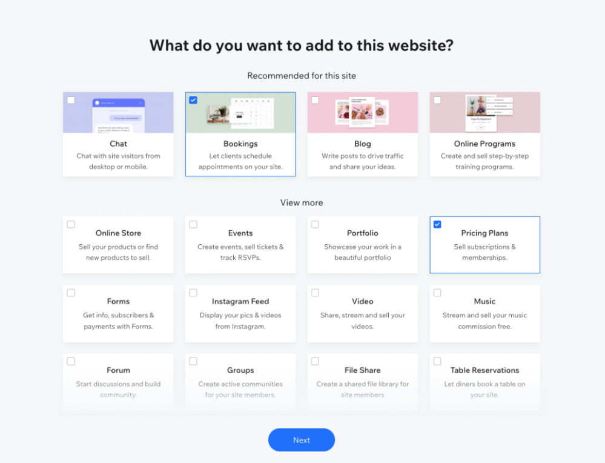

[](https://github.com/carmelc/vercel-demo-wix-appointments-subscriptions-nextjs-template/actions/workflows/sync-fork.yml)

### A Wix Bookings Next.js Coaching Professional Template


A [Next.js](https://nextjs.org/) project bootstrapped with [`create-next-app`](https://github.com/vercel/next.js/tree/canary/packages/create-next-app).

## Getting Started

In order to be able to integrate the Wix Bookings solution with the template, you should first define a business in Wix.


### Step 1: Create a business with [Wix](http://wix.com/intro/main)
For the integration to work, you must select Wix bookings and Wix Pricing Plans during the business creation onboarding:


If for any reason, you did not select either of the apps, you can also add it from the business [dashboard](https://manage.wix.com), go to:
1. Apps
2. App Market
3. Search for `Wix Bookings` and `Wix Pricing Plans`
4. Select `Wix Bookings` and click `Add to site`
5. Select `Wix Pricing Plans` and click `Add to site`

### Step 2: You can now set up the business solutions with the relevant services and plans
See [Wix Bookings Support article](https://support.wix.com/en/wix-bookings)

### Step 3: Quick Start with Deployment Platforms OR Consume APIs in the Template with an Oauth client ID
#### Option1: Quick Start with Deployment Platforms:
The following enables quick start deployment that automatically configures your project making it super easy to start with:

##### Netlify

[](https://manage.wix.com/headless-funnel-nextjs/netlify?repository=https://github.com/wix/wix-appointments-subscriptions-nextjs-template)

For more information, view [Netlify docs](https://www.netlify.com/blog/2020/11/30/how-to-deploy-next.js-sites-to-netlify/).

#### Option 2: Consume APIs in the Template with an Oauth client ID 
To consume the APIs in the template, you will need to create an Oauth client ID. You will be able to create this ID from your [dashboard](https://manage.wix.com):
1. Go to `Settings` in the dashboard 
2. Click `Oauth Apps` 
3. Click `Create New` to create a new Oauth Apps 
4. Once your app is created, copy the client id
   Only if you’ve chosen to consume APIs in the Template with an Oauth client ID, please continue to Step 4

### Step 4: Set up environment variables (this is only relevant if you use Oauth client IDs in Step 3)
**Note**: client ID should not be pushed to your source control

#### Local Development Environment 
1. run `cp .env.template .env.local`
2. Paste the client id you copied in step 3.4. into `NEXT_PUBLIC_WIX_CLIENT_ID=<Client ID>`
#### Production Environment
Add the `NEXT_PUBLIC_WIX_CLIENT_ID` environment variable with the client id value according to your deployment provider.

## Local Development
**Note: You must complete the Get Started set up instructions before starting local development**

Once you’ve obtained and configured the oauth client Id, run the development server:
```shell
yarn
yarn dev
```
or
```shell
npm i
npm run dev
```
Open http://localhost:3000 with your browser to see the template home page.

You can start editing the Home page by modifying `app/page.tsx`.<br>
The page auto-updates as you edit the file.

Similarly, you can edit any other page - `app/<route>/page.tsx` (as described in [NextJs routes docs](https://beta.nextjs.org/docs/routing/defining-routes))

## Checkout and Accepting Payments
Checkout is implemented by redirecting visitors to Wix managed pages. You can customize the checkout from the Wix business manager from the eCommerce Settings within the “Settings” section.

To enable visitors' online checkout, please follow these steps.
### Step 1: Publish the site
**Important Note**: You will not need to use the site that it published. This is just to enable the checkout page to go live on the web.

1. In your business [dashboard](https://manage.wix.com) click `Design Site`
2. Choose `Let Wix create a site for you` 
3. Choose any template
4. Click `Edit My Site Design`
5. Click `Publish`
6. In the "Publish" pop up you will be able to change the site’s address or connect a domain - this is the URL that will appear as your checkout redirect base URL. If you did not change the base URL in the Publish pop up, you can also do it later on (see Step 2)

### Step 2: To accept payments using the Wix business solutions you will need to upgrade to a Business Premium Plan
In case you do not upgrade, the checkout will not be available to the customers

### Step 3 (optional): Change the checkout redirect base URL
To change the redirect base URL, edit the URL name or Connect a domain from your business [dashboard](https://manage.wix.com)
Edit the URL name by going to your [dashboard](https://manage.wix.com):
1. Click Site Actions (next to Edit Site)
2. Click Rename Site
3. Change the ending to Site Address (URL) and Save
4. You can also Connect a Domain by following the instructions [here](https://support.wix.com/en/article/about-domains)

## Learn More about the Tech Stack
To customize the template and add more functionality, go to [Wix API docs](https://dev.wix.com/api/sdk/introduction)

This template is written in [Next.js](https://nextjs.org/docs) 13 using [Next.js app directory](https://beta.nextjs.org/docs/app-directory-roadmap).

To learn more about `Next.js`, take a look at the following resources:
- [Next.js Documentation](https://nextjs.org/docs) - learn about Next.js features and API.
- [Learn Next.js](https://nextjs.org/learn) - an interactive Next.js tutorial.
- [Next.js app directory](https://beta.nextjs.org/docs/app-directory-roadmap)

Additionally, this template uses the following libraries/features:
1. [React Server Components](https://nextjs.org/docs/advanced-features/react-18/server-components)
2. [TypeScript](https://www.typescriptlang.org/docs/handbook/release-notes/typescript-4-9.html)
3. [TanStack Query <sup>v4</sup>](https://tanstack.com/query/latest)
4. [Tailwind CSS](https://tailwindcss.com/)
5. [Flowbite](https://flowbite.com/)
6. [Wix client SDK](https://dev.wix.com/api/sdk/introduction)

## Deployment
You can deploy this repo using any platform which supports `Next.js` Version 13 ([And app directory roadmap](https://beta.nextjs.org/docs/app-directory-roadmap))

The repository only requires a single environment variable to be defined `NEXT_PUBLIC_WIX_CLIENT_ID` which points to the `client Id` required to access the business assets in Wix using APIs.
